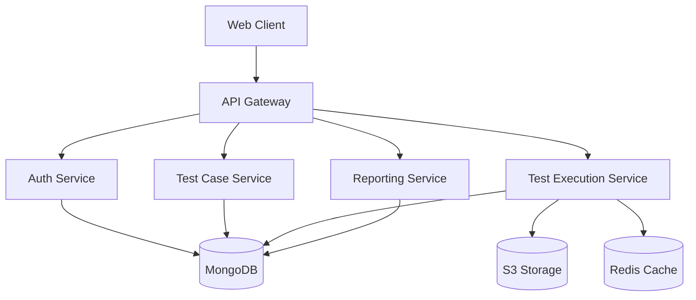

# TCManager Architecture Documentation

## System Overview
TCManager is built as a modern web application with a microservices architecture, focusing on scalability, maintainability, and performance.

## Architecture Diagram


## Technology Stack

### Frontend
- **Framework**: React with TypeScript
- **State Management**: Redux Toolkit
- **UI Library**: Material-UI
- **Build Tool**: Vite
- **Testing**: Jest, React Testing Library
- **Styling**: Styled Components, CSS Modules

### Backend
- **Runtime**: Node.js
- **Framework**: Express.js with TypeScript
- **API Documentation**: Swagger/OpenAPI
- **Testing**: Jest, Supertest
- **Logging**: Winston
- **Validation**: Joi

### Database
- **Primary Database**: MongoDB Atlas
- **Caching**: Redis
- **File Storage**: AWS S3
- **Search**: Elasticsearch

### Infrastructure
- **Containerization**: Docker
- **Orchestration**: Kubernetes
- **CI/CD**: GitHub Actions
- **Monitoring**: Prometheus & Grafana
- **Logging**: ELK Stack

## Component Architecture

### Frontend Components
```typescript
src/
├── components/          // Reusable UI components
│   ├── common/         // Shared components
│   ├── testcases/      // Test case components
│   ├── reports/        // Reporting components
│   └── dashboard/      // Dashboard components
├── features/           // Feature-based modules
│   ├── auth/          // Authentication
│   ├── projects/      // Project management
│   ├── testcases/     // Test case management
│   └── reports/       // Reporting
├── services/          // API services
├── store/             // State management
├── utils/             // Utility functions
└── types/             // TypeScript definitions
```

### Backend Services
```typescript
src/
├── controllers/       // Request handlers
├── models/           // Data models
├── services/         // Business logic
├── routes/           // API routes
├── middleware/       // Custom middleware
├── utils/            // Utility functions
└── types/            // TypeScript definitions
```

## Security Architecture

### Authentication
- JWT-based authentication
- OAuth 2.0 support
- Role-based access control
- API key management
- Session management

### Data Security
- Data encryption at rest
- TLS/SSL for data in transit
- Secure file storage
- Audit logging
- Regular security audits

## Performance Considerations

### Caching Strategy
- Redis for API response caching
- Browser caching for static assets
- CDN for global content delivery
- Database query optimization

### Scalability
- Horizontal scaling with Kubernetes
- Load balancing
- Database sharding
- Microservices architecture

## Monitoring & Logging

### System Monitoring
- Performance metrics
- Error tracking
- Resource utilization
- User activity monitoring

### Logging
- Application logs
- Access logs
- Error logs
- Audit logs
- Performance logs

## Deployment Architecture

### Environments
- Development
- Staging
- Production

### Deployment Process
1. Code commit
2. Automated testing
3. Build process
4. Container creation
5. Deployment to environment
6. Health checks
7. Monitoring setup

## Integration Points

### External Systems
- Playwright test framework
- CI/CD systems
- Issue trackers
- Project management tools
- Communication platforms

### APIs
- REST API
- GraphQL API
- WebSocket API
- Webhook system

## Disaster Recovery

### Backup Strategy
- Database backups
- File storage backups
- Configuration backups
- Regular backup testing

### Recovery Procedures
- Data recovery
- Service recovery
- System restoration
- Business continuity 