# TCManager UI Architecture & Page Diagrams

## Overview

This document contains comprehensive visual diagrams for the TCManager platform, showing system architecture, user flows, and detailed page layouts. The platform is designed as a hybrid combining the best features of TestRail (test management), Jira (project tracking), and ServiceNow (workflow management).

## System Architecture

### Technical Stack Architecture

### Application Flow & Navigation

### Feature Relationship Map

## Page-Specific Diagrams

### 1. Admin Portal Layout
*Inspired by ServiceNow admin interface with Jira-style system health monitoring*

```mermaid
graph TB
    subgraph "Admin Portal Layout"
        Header["Header: Admin Dashboard - User Profile - Logout"]
        
        subgraph "Left Sidebar Navigation"
            Nav1["👥 User Management"]
            Nav2["🏢 Organization Settings"]
            Nav3["🔐 Security & Permissions"]
            Nav4["🔧 System Configuration"]
            Nav5["📊 Analytics & Reports"]
            Nav6["🔌 Integrations"]
            Nav7["📋 Audit Logs"]
            Nav8["⚙️ System Health"]
        end
        
        subgraph "Main Content Area"
            subgraph "User Management Panel"
                UM1["Active Users: 145 - Pending: 3 - Inactive: 12"]
                UM2["Quick Actions: Add User - Bulk Import - Export"]
                UM3["User Table with Role Filters"]
                UM4["Role Assignment Matrix"]
            end
            
            subgraph "System Health Dashboard"
                SH1["System Status: All Services Online ✅"]
                SH2["Performance Metrics - Database Health - API Response"]
                SH3["Resource Usage Charts"]
                SH4["Error Logs & Alerts"]
            end
            
            subgraph "Integration Center - TestRail+Jira+ServiceNow Style"
                IC1["Jira Integration: ✅ Connected"]
                IC2["TestRail Migration: In Progress 🔄"]
                IC3["ServiceNow ITSM: ⚙️ Configure"]
                IC4["CI/CD Webhooks: 5 Active"]
                IC5["Custom Workflow Engine"]
            end
        end
        
        subgraph "Quick Stats Cards"
            QS1["Total Projects: 23"]
            QS2["Active Test Cases: 1,247"]
            QS3["Test Runs Today: 89"]
            QS4["System Uptime: 99.9%"]
        end
    end
    
    Header --> Nav1
    Nav1 --> UM1
    Nav8 --> SH1
    Nav6 --> IC1
    Header --> QS1
```

**Key Features:**
- **ServiceNow-style navigation**: Clean sidebar with role-based menu items
- **Jira-style system health**: Real-time status cards and performance metrics
- **TestRail integration**: Migration tools and test case statistics
- **Unified admin experience**: All administrative functions in one place

### 2. Home Dashboard (Post-Login)
*Combining Jira's project overview with TestRail's test execution status and ServiceNow's activity feeds*

```mermaid
graph TB
    subgraph "Home Dashboard - Post Login"
        TopBar["TCManager - Welcome Back, John Doe - Projects - Test Cases - Reports - Settings - Profile"]
        
        subgraph "Quick Action Bar"
            QA1["➕ Create Test Case"]
            QA2["▶️ Run Test Suite"]
            QA3["📊 View Reports"]
            QA4["🔍 Global Search"]
        end
        
        subgraph "Main Dashboard Grid"
            subgraph "Test Execution Status - Jira Style Cards"
                TES1["🟢 Passed: 89% (1,205 tests)"]
                TES2["🔴 Failed: 8% (108 tests)"]
                TES3["🟡 Pending: 3% (41 tests)"]
                TES4["⏸️ Blocked: 2 tests"]
            end
            
            subgraph "Recent Activity Feed - ServiceNow Style"
                RAF1["John updated Test Case TC-1234 - 2 min ago"]
                RAF2["New defect DEF-567 linked to TC-890 - 5 min ago"]
                RAF3["Automation run completed for Login Suite - 15 min ago"]
                RAF4["Sarah approved Test Plan for Release 2.1 - 1 hour ago"]
            end
            
            subgraph "My Work - TestRail Style"
                MW1["📋 Assigned to Me: 23 test cases"]
                MW2["✅ Pending Review: 5 test cases"]
                MW3["🔄 In Progress: 8 test executions"]
                MW4["⏰ Due Today: 3 test plans"]
            end
            
            subgraph "Project Health Overview"
                PHO1["E-Commerce Project: 🟢 On Track"]
                PHO2["Mobile App: 🟡 At Risk - 12 failing tests"]
                PHO3["API Gateway: 🟢 Healthy - 100% pass rate"]
                PHO4["Payment System: 🔴 Critical - 5 blockers"]
            end
            
            subgraph "Trending Metrics - Analytics"
                TM1["📈 Test Coverage: 87% (+2% this week)"]
                TM2["⚡ Avg Execution Time: 2.3 min (-15% improvement)"]
                TM3["🔧 Automation Rate: 76% (+5% this month)"]
                TM4["🎯 Defect Detection: 94% efficiency"]
            end
            
            subgraph "Quick Links & Favorites"
                QL1["⭐ Regression Test Suite"]
                QL2["⭐ API Test Collection"]
                QL3["📱 Mobile Test Scenarios"]
                QL4["🔧 Automation Scripts Library"]
            end
        end
        
        subgraph "Right Sidebar"
            RS1["📅 Upcoming Deadlines"]
            RS2["🔔 Notifications (3)"]
            RS3["👥 Team Status"]
            RS4["🎯 Sprint Goals"]
        end
    end
    
    TopBar --> QA1
    QA1 --> TES1
    TES1 --> RAF1
    RAF1 --> MW1
    MW1 --> PHO1
    PHO1 --> TM1
    TM1 --> QL1
    TopBar --> RS1
```

**Key Features:**
- **Jira-style status cards**: Visual test execution status with color coding
- **ServiceNow activity feed**: Real-time updates on team activities and system events
- **TestRail work assignment**: Personal task management and test case assignments
- **Comprehensive analytics**: Trending metrics and performance improvements
- **Quick access**: Favorite test suites and frequently used features

### 3. Test Case Management Page
*TestRail's test case organization with Jira's table interface and ServiceNow's hierarchical navigation*

```mermaid
graph TB
    subgraph "Test Case Management Page - Hybrid TestRail+Jira+ServiceNow"
        Header["Test Case Management - Project: E-Commerce - Module: User Authentication"]
        
        subgraph "Toolbar & Filters"
            TB1["➕ New Test Case"]
            TB2["📥 Import from TestRail"]
            TB3["🔄 Bulk Operations"]
            TB4["📤 Export"]
            
            Filter1["🔍 Filter: Status - Priority - Assignee - Tags"]
            Filter2["📅 Date Range - Last Modified - Created By"]
            Search["🔍 Search test cases..."]
        end
        
        subgraph "Test Case Hierarchy - ServiceNow Tree Style"
            Tree1["📁 Authentication Module"]
            Tree2["├── 📁 Login Scenarios"]
            Tree3["│   ├── TC-001: Valid Login"]
            Tree4["│   ├── TC-002: Invalid Credentials"]
            Tree5["│   └── TC-003: Account Lockout"]
            Tree6["├── 📁 Registration Flow"]
            Tree7["└── 📁 Password Reset"]
        end
        
        subgraph "Main Test Case Grid - Jira Table Style"
            subgraph "Table Headers"
                TH1["ID"]
                TH2["Title"]
                TH3["Priority"]
                TH4["Status"]
                TH5["Assignee"]
                TH6["Last Run"]
                TH7["Actions"]
            end
            
            subgraph "Sample Rows"
                R1["TC-001 - Valid User Login - High - ✅ Active - John D. - 2h ago - ⚙️"]
                R2["TC-002 - Invalid Password - Medium - 🔄 Review - Sarah M. - 1d ago - ⚙️"]
                R3["TC-003 - Account Lockout - High - ❌ Failed - Mike R. - 3h ago - ⚙️"]
            end
        end
        
        subgraph "Test Case Details Panel - TestRail Style"
            Details1["📝 Test Case: TC-001 - Valid User Login"]
            Details2["📋 Preconditions: User has valid account"]
            Details3["🔢 Test Steps:"]
            Details4["   1. Navigate to login page"]
            Details5["   2. Enter valid username"]
            Details6["   3. Enter valid password"]
            Details7["   4. Click login button"]
            Details8["✅ Expected Result: User successfully logged in"]
            Details9["🔗 Linked Items: REQ-123, DEF-456"]
            Details10["📊 Automation: Playwright script attached"]
        end
        
        subgraph "Action Sidebar"
            AS1["▶️ Execute Test"]
            AS2["📝 Edit Test Case"]
            AS3["📋 Clone Test Case"]
            AS4["🔗 Link Requirements"]
            AS5["📈 View History"]
            AS6["🔄 Convert to Automated"]
            AS7["📊 View Results"]
            AS8["💬 Add Comment"]
        end
        
        subgraph "Bottom Status Bar"
            Status1["Total: 247 test cases"]
            Status2["Active: 198"]
            Status3["Under Review: 12"]
            Status4["Automated: 76%"]
            Status5["Last Sync: 5 min ago"]
        end
    end
    
    Header --> TB1
    TB1 --> Filter1
    Filter1 --> Tree1
    Tree1 --> TH1
    TH1 --> R1
    R1 --> Details1
    Details1 --> AS1
    AS1 --> Status1
```

**Key Features:**
- **TestRail test organization**: Hierarchical test case structure with detailed step definitions
- **Jira-style data tables**: Sortable, filterable grids with bulk operations
- **ServiceNow tree navigation**: Expandable folder structure for logical organization
- **Integrated automation**: Direct links to test scripts and execution history
- **Rich linking**: Connections to requirements, defects, and related items

## Additional System Diagrams

### API Interaction Flow

### Data Model Structure

### Development Roadmap

## Hybrid Platform Features

### TestRail Integration Features
- **Test case import/export**: Seamless migration from existing TestRail instances
- **Test suite organization**: Hierarchical structure similar to TestRail's folders
- **Test execution tracking**: Real-time status updates and result recording
- **Custom fields**: Support for TestRail-style custom test case properties

### Jira Integration Features
- **Issue linking**: Direct connections between test cases and Jira tickets
- **Workflow automation**: Trigger test executions based on Jira status changes
- **Dashboard widgets**: Jira-style configurable dashboard components
- **Bulk operations**: Mass edit capabilities similar to Jira's bulk change

### ServiceNow Integration Features
- **ITSM workflows**: Incident and change management integration
- **Service catalog**: Test service requests and approval processes
- **Knowledge management**: Test documentation and best practices library
- **SLA tracking**: Test execution deadlines and service level agreements

## Technology Stack Integration

### Frontend Technologies
- **Next.js 14**: React framework with App Router
- **Material-UI**: Component library for consistent UI
- **Redux**: State management for complex data flows
- **TypeScript**: Type safety and developer experience

### Backend Technologies
- **Express.js**: RESTful API server
- **MongoDB**: Document database for flexible schema
- **Mongoose**: ODM for MongoDB with validation
- **JWT**: Authentication and authorization

### DevOps & Deployment
- **Railway**: Cloud deployment platform
- **GitHub**: Version control and CI/CD
- **Docker**: Containerization for consistent deployments
- **Monitoring**: Health checks and performance metrics

This comprehensive diagram collection provides a complete visual guide for implementing the TCManager platform with the hybrid approach combining the best features of TestRail, Jira, and ServiceNow. 